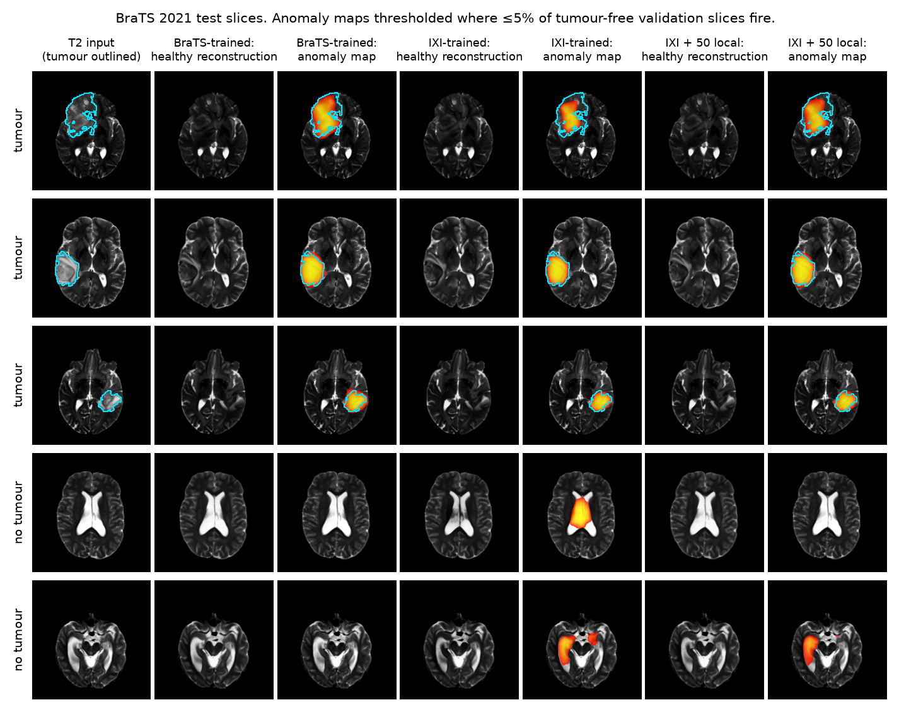
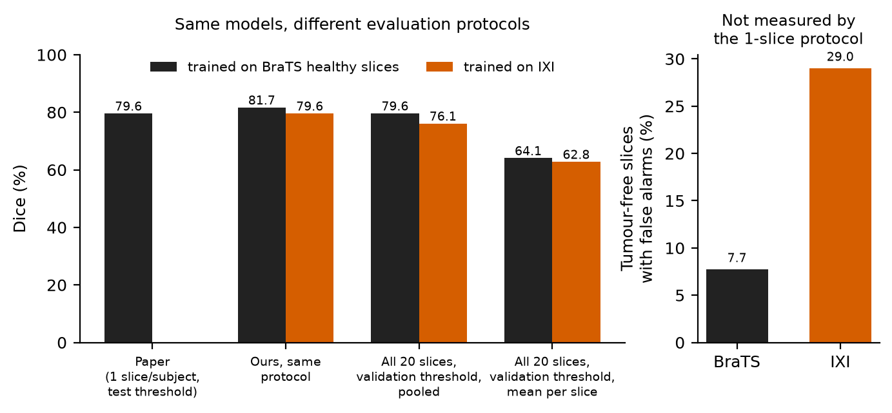
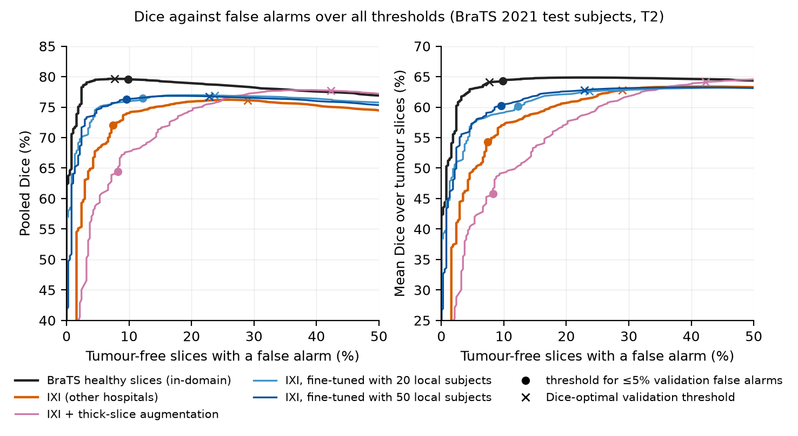
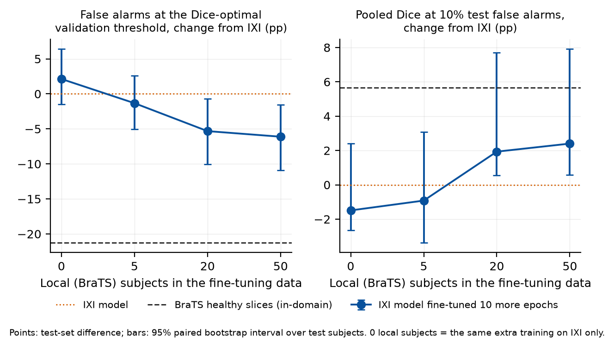

# Healthy from where? REFLECT brain-tumour detection across protocols and hospitals

Unsupervised anomaly detection learns what healthy brains look like and flags
what a model cannot map back to healthy anatomy. REFLECT (Beizaee et al.,
MICCAI 2025) does this with a rectified flow in the latent space of a medical
VAE, correcting an abnormal scan towards a healthy one in a few steps. This
repository reproduces REFLECT on BraTS 2021 T2 and then evaluates it the way a
hospital would use it: on every slice, with thresholds fixed in advance, and
with healthy training scans from other hospitals.

Technical report: [`report/report.pdf`](report/report.pdf).



*BraTS 2021 test slices with each model's healthy reconstruction and its
anomaly map at a threshold fixed on validation subjects (at most 5% of their
tumour-free slices fire). Tumour rows are drawn at random from three tumour
sizes; the two tumour-free rows are the slices where the IXI-trained model
fires most, so they show its typical failure, not an average slice.*

## Main findings

All intervals are 95% bootstrap intervals over the 126 test subjects
(`scripts/curves.py`); differences between models use paired resamples.

1. REFLECT reproduces. Under the paper's protocol the pooled Dice is 81.7
   against 79.6 reported.
2. The paper's protocol hides false alarms. Scored on all 20 central slices
   per subject with a validation-chosen threshold, the same model has a mean
   Dice of 64.1 per tumour slice, and 7.7% of tumour-free slices contain false
   positives. The single-slice protocol has no tumour-free slices to measure.
3. Healthy scans from other hospitals mostly cost false alarms. Training
   on IXI (healthy volunteers, three London hospitals) instead of tumour-free
   BraTS slices lowers pooled Dice by only 3.5 points [2.1, 5.0] at each
   model's Dice-optimal threshold, but raises the false-alarm rate from 7.7%
   to 29.0% (difference 21.3 points [9.3, 35.3]). At an equal 10% false-alarm
   rate the Dice gap is 5.7 points [2.7, 12.3].
4. A few dozen local scans close part of the gap; extra training alone does
   not. Ten epochs of fine-tuning with tumour-free slices from 20 or 50 local
   subjects lower false alarms by 5.3 [0.7, 10.1] and 6.1 [1.6, 10.9] points
   and raise Dice at a 10% false-alarm rate by 2.0 [0.6, 7.7] and 2.4
   [0.6, 7.9] points. The same ten epochs on IXI alone change neither
   (intervals include zero).
5. AUPRC can reward the wrong model. Simulated thick-slice acquisitions
   raise AUPRC from 0.828 to 0.862 (+3.4 points [1.5, 5.5]), almost the
   in-domain 0.865, but the model also flags more healthy tissue (42.3% false
   alarms at its Dice-optimal threshold). At a threshold fixed for 5% validation false alarms its pooled Dice
   is 64.4 against 72.0 for plain IXI training (−7.6 [−9.2, −6.0]), at similar
   test false-alarm rates (8.2% and 7.4%).

## Results

### Reproduction and evaluation protocol



REFLECT-1, UNet-M, KL-f8 VAE, trained with the paper's settings (200 epochs,
batch 96, lr 5e-4) on tumour-free central slices of the BraTS training
subjects; 5 correction steps unless noted.

| Protocol | Dice | Notes |
|---|---|---|
| Paper, REFLECT protocol | 79.6 | |
| Ours, REFLECT protocol, pooled max Dice | 81.7 | 1 step: 80.8 |
| Ours, REFLECT protocol, mean per-slice max Dice | 74.5 | 1 step: 73.7 |
| Ours, strict, pooled Dice | 79.6 [76.9, 81.9] | threshold from validation subjects |
| Ours, strict, mean Dice over tumour slices | 64.1 [59.7, 68.3] | |

REFLECT protocol: one slice per test subject (the one with the largest tumour,
116 subjects), threshold swept on the test slices. Strict protocol: all 20
central slices of each test subject (2520 slices, 2144 with tumour, 376
tumour-free from 41 subjects), threshold fixed on the validation subjects'
slices, anomaly maps restricted to the brain.

- Choosing the threshold on the test set costs almost nothing here: the
  validation threshold gives 79.6 against 79.7 with the test-optimal one.
- Pooled Dice barely changes between protocols because large tumours dominate
  the pixel count; the mean Dice per tumour slice falls by about 10 points once
  every slice counts.
- The paper does not state which aggregate it reports; our pooled Dice is
  slightly above it and our per-slice Dice a few points below.

### Healthy training data from other hospitals

The same model trained on 7520 healthy IXI slices for the same number of
updates, tested on the same BraTS subjects. Point estimates with 95% bootstrap
intervals; "FA" is the fraction of tumour-free test slices with any positive
pixel.

| Healthy training data | AUPRC | Dice-optimal threshold: pooled Dice / FA | At 10% test FA: pooled / mean Dice |
|---|---|---|---|
| BraTS (in-domain) | 0.865 [0.829, 0.893] | 79.6 [76.9, 81.9] / 7.7 [2.5, 15.1] | 79.6 [76.8, 81.7] / 64.3 [59.5, 68.5] |
| IXI | 0.828 [0.777, 0.866] | 76.1 [72.6, 79.0] / 29.0 [17.2, 43.5] | 73.9 [66.3, 77.9] / 57.0 [47.8, 62.8] |
| IXI, thick-slice augmentation | 0.862 [0.827, 0.889] | 77.7 [74.5, 80.5] / 42.3 [29.2, 57.2] | 67.6 [54.5, 75.6] / 49.1 [35.9, 59.1] |
| IXI, + 10 epochs on IXI only (control) | 0.828 [0.779, 0.865] | 75.8 [72.5, 78.7] / 31.1 [19.3, 45.8] | 72.5 [66.1, 76.9] / 55.3 [48.6, 61.8] |
| IXI, + 10 epochs with 5 local subjects | 0.829 [0.779, 0.865] | 76.4 [73.0, 79.1] / 27.7 [16.5, 41.8] | 73.0 [66.8, 77.3] / 55.6 [48.5, 61.7] |
| IXI, + 10 epochs with 20 local subjects | 0.833 [0.786, 0.868] | 76.9 [73.8, 79.5] / 23.7 [14.0, 35.8] | 75.9 [71.9, 79.3] / 59.0 [54.0, 64.4] |
| IXI, + 10 epochs with 50 local subjects | 0.834 [0.789, 0.868] | 76.8 [73.8, 79.3] / 22.9 [13.1, 35.0] | 76.3 [72.3, 79.3] / 60.4 [54.8, 65.2] |

The intervals of single models overlap because every model sees the same hard
subjects; the paired differences in the findings above and in
[`reported/curves/summary.json`](reported/curves/summary.json) are the
comparisons to read. The last column picks, for each model, the threshold at
which 10% of tumour-free test slices fire, so models are compared at equal
false-alarm rates regardless of how well their validation thresholds transfer.



At each model's Dice-optimal threshold (crosses) the curves look close; the
models separate at the low false-alarm rates a screening tool would run at.
Validation thresholds (dots) transfer only roughly: aiming for 5% false alarms
on validation gives 7–17% on test.

### Remedies

- Intensity harmonisation (`eval_reflect.py --harmonise`): matching each
  test subject's brain histogram to the IXI training data does not help (false
  alarms 33.5%, pooled Dice 75.0). The shift is not a difference in intensity
  distribution alone.
- Thick-slice augmentation (`export_reflect_ixi.py --thick 1,...,6`: slab
  averaging along a random axis, resampled to 1 mm, since many BraTS T2 scans
  are thick-slice acquisitions): raises AUPRC and Dice-optimal Dice (76.1 to
  77.7), but lowers Dice at a fixed validation false-alarm budget (finding 5).
- Local fine-tuning (`scripts/make_mix.py`): IXI plus the tumour-free
  slices of N randomly chosen BraTS training subjects, oversampled ×10,
  10 epochs at lr 5e-5 (about 30 minutes).



With 20 or 50 local subjects the model recovers 35–42% of the Dice gap
to the in-domain model at a 10% false-alarm rate. The control with the same
extra training on IXI only does not move, so the gain comes from the local
data. Caveat: there are no healthy BraTS-site scans, so the "local" slices are
tumour-free slices of other tumour patients (see the next section).

### Where the false alarms are

`scripts/fp_analysis.py` and `scripts/fp_figure.py`
([`reported/fp_analysis/fp_slices.png`](reported/fp_analysis/fp_slices.png)).
The IXI model's false alarms are bright regions (mean intensity 0.45 against
0.27 for the brain) and only about 10% lie near the brain border. They are not
explained by through-plane resolution (Spearman ρ = 0.19, p = 0.24 against a
per-subject sharpness proxy), by distance to the tumour (21.5% of slices fire
even in subjects whose 20 central slices contain no tumour), or by ventricle
size. Visually they cover ventricles enlarged or displaced by mass effect, low
frontal slices and distorted anatomy, which the model trained on tumour-free
slices of the BraTS patients reconstructs without complaint. The in-domain
result therefore benefits from tumour patients' anatomy appearing in its
"healthy" training data, and the local slices used for fine-tuning carry the
same advantage.

## Attempts that did not work

Kept for transparency; none is used in a comparison above.

- Intensity harmonisation to the training distribution (above).
- `uad/` and `scripts/train.py` / `evaluate.py`: my reimplementations of an
  autoencoder, an AnoDDPM-style DDPM and a patched DDPM (pDDPM, Behrendt et
  al., MIDL 2023) on 96 × 96 volumes with pDDPM's preprocessing
  (`scripts/preprocess.py`). The DDPM reaches 22.6 Dice on BraTS 2021 against
  40.7 reported, after matching the reference code's noise scale, intensity
  scaling and U-Net widths. I moved to REFLECT, whose released code made an
  exact reproduction possible.

## Limitations

- T2 only, one dataset pair (IXI → BraTS 2021), 2D slices.
- 376 tumour-free test slices from 41 subjects: false-alarm rates have wide
  intervals, and the correlations in the false-alarm analysis are underpowered.
- Bootstrap intervals cover test-subject sampling only. Repeated training
  seeds for the IXI, thick-slice, fine-tuned and in-domain models are running
  and will be added here.
- No acquisition metadata for BraTS, and no healthy scans from the BraTS sites.

## Setup

- BraTS 2021 (1251 scans; T2 and whole-tumour masks), split 80/10/10 by
  subject (seed 0) as in REFLECT. 20 central axial slices per scan, brain
  1st–99th intensity percentiles mapped to 0–255, 240 × 240 in SRI24/BraTS
  space, padded to 256 (`scripts/export_reflect.py`). REFLECT registers to
  MNI152 instead; its exact scaling is not published.
- IXI (578 healthy T2 scans from three London hospitals): HD-BET skull
  stripping (`scripts/run_hdbet.sh`), affine registration to SRI24 with ANTs,
  same slicing and scaling (`scripts/export_reflect_ixi.py`).
- REFLECT is run from the authors' code
  ([farzad-bz/REFLECT](https://github.com/farzad-bz/REFLECT), commit 6e05909)
  with `patches/reflect_0001_16gb_and_torch26.patch`: full loading of the
  pickled VAE under PyTorch ≥ 2.6, CPU map-location for evaluation, VAE
  encoding in chunks of 16 and U-Net updates in micro-batches of 48 with
  size-weighted losses (identical gradients, GroupNorm only) to fit 16 GB, and
  a fix to the released test loader, which returns an undefined variable.
- **Compute**: one RTX 5070 Ti (16 GB). Training from scratch takes about
  3.5 hours, fine-tuning about 30 minutes, scoring a model about 4 minutes.

## Running

```bash
uv sync                                        # this repo's env
bash scripts/run_hdbet.sh                      # IXI skull stripping
python scripts/export_reflect.py               # BraTS 2021 slices
python scripts/export_reflect_ixi.py           # IXI slices
# REFLECT: clone into third_party/REFLECT, apply the patch, build its env
torchrun train_REFLECT.py --dataset BraTS --model UNet_M --vae kl_f8 --modality T2 \
    --lr 5e-4 --global-batch-size 96 --epochs 200 --data-dir ../../data/reflect_brats21_t2
R=third_party/REFLECT/.venv/bin/python
$R scripts/eval_reflect.py --ckpt CKPT --data data/reflect_brats21_t2 --steps 5 --out results/reflect_brats21
# per-slice counts on a threshold grid; everything after this runs on the CPU
$R scripts/dump_curves.py --model brats=CKPT --model ixi=CKPT2 --data data/reflect_brats21_t2 --out results/curves
python scripts/curves.py --curves results/curves --out reported/curves
python scripts/paper_figures.py --curves results/curves --summary reported/curves --out figures
```

| Path | Contents |
|---|---|
| `scripts/eval_reflect.py` | REFLECT protocol and strict protocol for one checkpoint |
| `scripts/operating_points.py` | thresholds at fixed validation false-alarm rates |
| `scripts/dump_curves.py` | per-slice counts for offline thresholding, maps and reconstructions |
| `scripts/curves.py` | bootstrap intervals, paired differences, Dice / false-alarm curves |
| `scripts/paper_figures.py` | the figures in `figures/` |
| `scripts/fp_analysis.py`, `fp_figure.py` | where the false alarms are |
| `reported/` | every number in this README, as JSON |
| `report/` | technical report (LaTeX source and PDF) |

## Licence and data

Apache-2.0 for this repository's code. REFLECT's code is not redistributed
(no licence file); only the patch is included. IXI (CC BY-SA 3.0) and
BraTS 2021 (cite the challenge papers) are not redistributed.

## Citation

```bibtex
@techreport{krastev2026healthyfromwhere,
  author      = {Krastev, Matey},
  title       = {Healthy from where? Evaluating a rectified-flow brain anomaly detector across protocols and hospitals},
  institution = {Independent research},
  year        = {2026},
  url         = {https://github.com/m-krastev/brain-uad}
}
```
